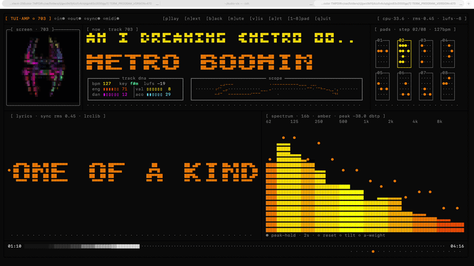

# AMP

> A Spotify-connected terminal music visualizer — rendered entirely in your shell with ANSI block glyphs, Braille dot-matrix, and cava-style FFT analysis.



---

## Features

| Area | What you get |
|------|-------------|
| **Album art** | Quadrant-block sub-pixel rendering (`▘▝▖▗▚▞`) — doubles horizontal resolution over half-block art |
| **Bitfont marquee** | Block-letter billboard display for track/artist — never falls back to plain text; shrinks progressively across three sizes |
| **Track DNA** | Deterministic per-track fingerprint: bpm · key · lufs · energy · valence · danceability · acousticness — colour-coded |
| **Lissajous scope** | Braille dot-matrix X-Y phase scope with phosphor persistence; frequencies driven by spectral centroid |
| **Beat-machine pads** | 8 BPM-synced pads with randomised patterns seeded from Track DNA — lights on every beat |
| **Karaoke lyrics** | Current lyric char-reveal with 250 ms lead compensation; fetched from lrclib |
| **cava-style spectrum** | 16-band FFT display with greyscale shade ramp, peak-hold dots, Hz labels, and bass-bin accent flash |
| **Progress bar** | Greyscale shade ramp `░▒▓█` with sub-block playhead; re-anchors baseline every Spotify poll to prevent drift after pause/seek |
| **Status LEDs** | in / out / sync / midi blink indicators in the title bar |
| **Playback control** | Play · pause · next · prev · mute — without leaving the terminal |

---

## Requirements

| Requirement | Details |
|-------------|---------|
| **Node.js** | ≥ 18.0.0 |
| **Spotify account** | Free accounts can read metadata; Premium required for playback control |
| **Spotify Developer app** | Free to create at [developer.spotify.com/dashboard](https://developer.spotify.com/dashboard) |
| **Audio loopback** | Routes your system audio so the FFT can analyse it (see platform notes below) |
| **Terminal** | 108 × 28 minimum; 120 × 30+ recommended — true-colour ANSI support required |

### Platform loopback setup

**macOS** — [BlackHole](https://github.com/ExistentialAudio/BlackHole) (free, open source)

1. Install BlackHole 2ch.
2. Open **Audio MIDI Setup** → create a **Multi-Output Device** containing both your speakers/headphones _and_ BlackHole 2ch.
3. Set that Multi-Output Device as your system output.
4. Pass `--audio-device "BlackHole 2ch"` when launching (or let `myviz launch` detect it).

**Linux** — PulseAudio / PipeWire monitor source

```bash
parecord --list-sources        # find your monitor source name
# then pass it with --audio-device
```

**Windows** — ffmpeg WASAPI loopback

```bash
winget install ffmpeg
# enable "Stereo Mix" in Windows sound settings, then pass --audio-device "Stereo Mix"
```

> **No audio hardware?** Use `--silent` to run with silence — the UI, lyrics, metadata and beat pads all still work.

---

## Quick start

```bash
# 1. Clone
git clone https://github.com/your-username/audio-vis.git
cd audio-vis

# 2. Install dependencies
npm install

# 3. Configure Spotify credentials
cp .env.example .env
#   → fill in SPOTIFY_CLIENT_ID and SPOTIFY_CLIENT_SECRET (see below)

# 4. Log in to Spotify (opens a browser window once)
npm run dev -- spotify login

# 5. Launch
npm run dev -- visualizer
```

> First-time Spotify login opens `http://127.0.0.1:8888/callback` in your browser. Accept the permissions, then return to the terminal.

---

## Spotify credentials

1. Go to [developer.spotify.com/dashboard](https://developer.spotify.com/dashboard) and create a new app (any name).
2. In the app settings, add this **Redirect URI**:
   ```
   http://127.0.0.1:8888/callback
   ```
3. Copy your **Client ID** and **Client Secret** into `.env`:

```env
SPOTIFY_CLIENT_ID=your_client_id_here
SPOTIFY_CLIENT_SECRET=your_client_secret_here
SPOTIFY_REDIRECT_URI=http://127.0.0.1:8888/callback
```

---

## Controls

| Key | Action |
|-----|--------|
| `p` | Play / pause |
| `n` | Next track |
| `b` | Previous track |
| `m` | Mute / unmute |
| `v` | Cycle visualiser mode |
| `a` | Toggle album art |
| `1`–`8` | Trigger pad |
| `q` / `Ctrl+C` | Quit |

---

## CLI reference

```bash
# Launch (development)
npm run dev -- visualizer

# Launch (after build)
npm run build
node dist/index.js visualizer

# Common options
npm run dev -- visualizer --audio-device "BlackHole 2ch"
npm run dev -- visualizer --silent          # no audio capture (UI still works)
npm run dev -- visualizer --fft-size 4096  # larger FFT window
npm run dev -- visualizer --no-color       # greyscale mode

# Spotify sub-commands
npm run dev -- spotify login
npm run dev -- spotify current
npm run dev -- spotify devices
npm run dev -- spotify next
npm run dev -- spotify pause
npm run dev -- spotify volume 80
```

---

## How it works

```
Spotify Web API ─────────────── track metadata · playback state · album art · lyrics
                                        │
                               AMP render loop (30 fps)
                                        │
system audio → loopback capture → 2048-point FFT → cava-style magnitude bins
                                        │
                               ANSI frame buffer → terminal
```

**Key design decisions:**

- `Renderer` maintains a per-cell dirty buffer — only changed rows are flushed each frame (zero full-screen clears)
- Album art is fetched once, resized via `jimp`, then rendered with quadrant-block `▘▝▖▗▚▞▙▛▜▟` glyphs (2×2 sub-pixel truecolor)
- Track DNA (`bpm`, `key`, `lufs`, etc.) is derived deterministically from track name + artist via djb2 + splitmix32 — no extra API calls required
- The Lissajous scope uses a Braille bitmask ring buffer (U+2800 + 8-bit cell mask) with exponential decay for phosphor persistence
- Lyrics sync uses a 250 ms look-ahead offset to compensate for Spotify poll latency

---

## Development

```bash
npm install
npm run build        # tsc
npm test             # build + node --test (132 tests)
```

Tests use Node's built-in `node:test` runner and hit no network. The renderer exposes a `debugLines()` method for snapshot-style assertions.

---

## Tech stack

- **TypeScript** + ESM modules, Node.js 18+
- **Spotify Web API** — 1 Hz polling for playback state, metadata, and baseline re-anchoring
- **FFT / DSP** — 2048-point real FFT, 16 logarithmic bins, gamma correction (γ = 0.40), spectral tilt ramp
- **ANSI rendering** — true-colour SGR escape codes, frame-buffer dirty-row tracking
- **Braille dot-matrix** — U+2800–U+28FF bitmask encoding for 2×4 sub-pixel Lissajous scope
- **Quadrant-block glyphs** — `▘▝▖▗▚▞▙▛▜▟` for 2×2 sub-pixel album art
- **cava-inspired spectrum** — reactive magnitude with pre-gain, gamma, spectral tilt, and peak-hold decay
- **lrclib** — open lyrics API for time-synced karaoke data
- **jimp** — pure-JS image processing (no native deps) for album art resize + pixel extraction
- **commander** — CLI sub-command routing

---

## Project layout

```
src/
  player/           # AMP app — state, layout, feeders, widgets
    widgets/        # albumArt · nowPlaying · lyrics · spectrum · controls · titleBar · queuePads
    feeders/        # spotify · albumArt · lyrics · audio polling loops
  ui/               # renderer · input · bitfont · tui layout primitives
  album/            # ansilize (quadrant-block renderer) · converter
  spotify/          # OAuth flow · token storage · Web API client
  audio/            # platform audio capture backends
  dsp/              # FFT · smoothing · energy extraction
  cli/              # commander sub-commands
```

---

## License

MIT
